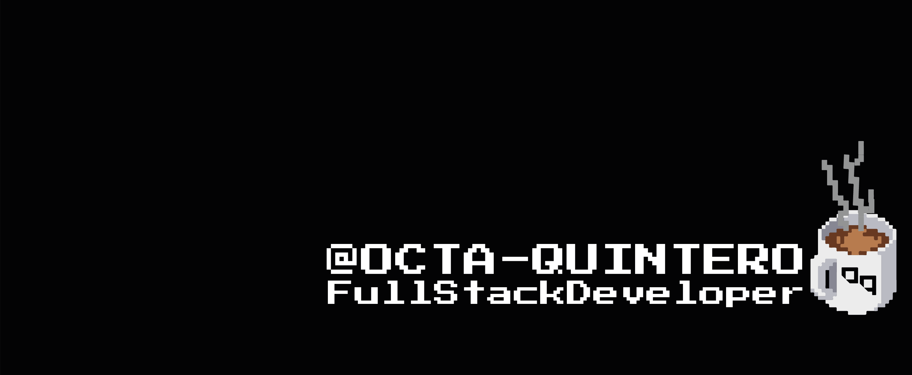

###

<h4 align="left">
Soy desarrollador FullStack enfocado en proyectos independientes, donde diseño y construyo aplicaciones web de principio a fin. La resolución de problemas tanto en el frontend como en el backend me ha dado una visión completa del ciclo de vida del software, convirtiéndome en un desarrollador versátil y orientado a resultados.
</h4>

<h4 align="left">
Sono uno sviluppatore FullStack focalizzato su progetti indipendenti, dove progetto e costruisco applicazioni web dall'inizio alla fine. Risolvere problemi sia nel frontend che nel backend mi ha dato una visione completa del ciclo di vita del software, rendendomi uno sviluppatore versatile e orientato ai risultati.
</h4>

###

<h4 align="left">📨  octa.quinteroo@gmail.com 📞 +543585106603</h4>

###

###

###
