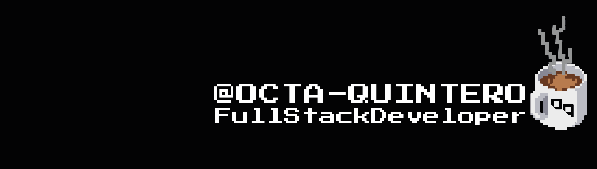

<h1 align="center">Hola!! Soy Octavio✨</h1>

###

  

<h3 align="left">Actualmente, me estoy desarrollando como programador FullStack en proyectos independientes, donde implemento mi capacidad para crear aplicaciones web completas, desde la conceptualización hasta la ejecución. Encontrar soluciones a posibles problemas tanto en el frontend como en el backend me ha permitido comprender el ciclo de vida de una aplicación web, convirtiéndome en un desarrollador versátil.</h3>

###

  
  
  
  
  
  
  
  
  
  
  
  
  
  
  
  
  
  
  
  
  
  
  
  
  
  
  
  

###

📨  octa.quinteroo@gmail.com 📠+543585106603

###

###

  

###
